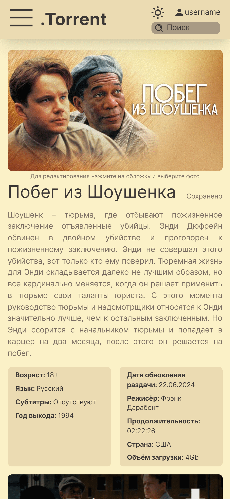

# .Torrent frontend
> .Torrent - сервис обмена .torrent файлами видеоигр, фильмов и аудиокниг

## Стек
- TypeScript
- React 18
- Next.js 14 (App Router)
- Tailwind CSS
- Zod
- React Hook Form
- SWR
- clsx
- и другие
  - next-themes
  - js-cookie
  - jwt-decode
  - react-dropzone

## Возможности
- Главная страница со списком популярных видеоигр, фильмов, аудиокниг
- Страницы со списками по категориям (отдельно видеоигры, фильмы, аудиокниги)
- Страница просмотра, редактирования или добавления сущности
- Форма входа или регистрации в виде модального окна с помощью Parallel и Intercepting маршрутов в Next.js
- Адаптивная верстка. Корректное отображение на мобильных устройствах, планшетах, ноутбуках, десктопах
- SEO оптимизация. SSR, метаданные к страницам
- Валидация данных с помощью Zod. Некорректные (или неполные) данные вырезаются (если некорректна одна сущность из списка, то остальные отображаются)
- Структура проекта в соответствии с Feature-Sliced Design
- Цветовая схема Gruvbox. Возможность переключения тёмной и светлой темы
- Вся конфигурация через файл .env (или переменные среды), для удобного запуска в Docker контейнере

## Скриншоты
|||
|-|-|
|||
|||
|||
|||

## Запуск
### Локально
    npm install
    npm run dev

## ToDo
- [ ] Dockerfile
- [ ] Добавить ссылку на общий репозиторий
- [ ] Теги жанров для сущностей
- [ ] Поиск
- [ ] Динамические метаданные к страницам [section]/*
- [ ] Страница "О проекте"